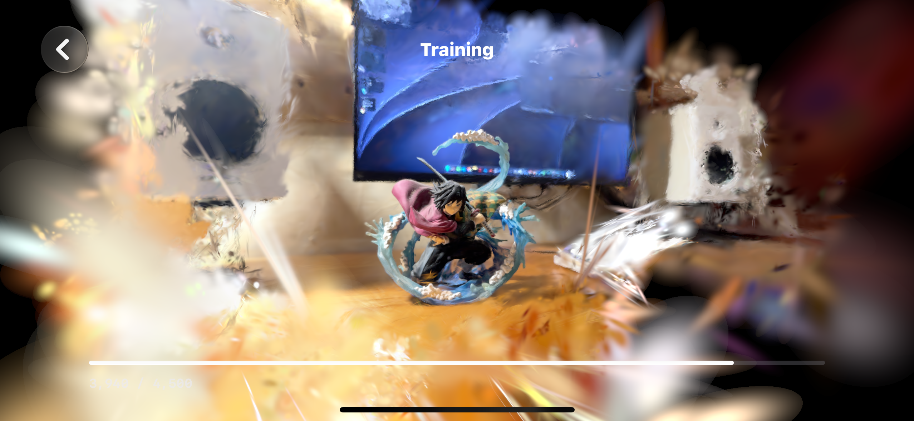

# memo

<p align="center">
  
</p>

memo is an end-to-end 3D Gaussian Splatting app for iPhone.

Capture with ARKit/Lidar. Train locally with Metal. Render the finished Gaussian splat on device.

The scan stays on the phone as a local capture package: RGB keyframes, camera poses, intrinsics, and LiDAR depth. [`msplat`](https://github.com/rayanht/msplat) trains the Gaussian scene; [MetalSplatter](https://github.com/scier/MetalSplatter) displays it in real time.

```
iPhone capture -> on-device 3DGS training -> Gaussian splat rendering
```

## Stack

- SwiftUI and ARKit for iPhone capture
- [`msplat`](https://github.com/rayanht/msplat) for on-device 3D Gaussian Splatting training
- [MetalSplatter](https://github.com/scier/MetalSplatter) for real-time Gaussian splat rendering
- XcodeGen for the iOS project

## Layout

- `ios/` — the memo app
- `msplat/` — local Metal training engine
- `MetalSplatter/` — Swift/Metal renderer
- `docs/` — notes and references

## Build

```bash
cd ios && xcodegen generate
xcodebuild -project ios/memo.xcodeproj -scheme memo -configuration Debug build
```

Requires iOS 18, Metal, ARKit, and a depth-capable device for best capture results.
